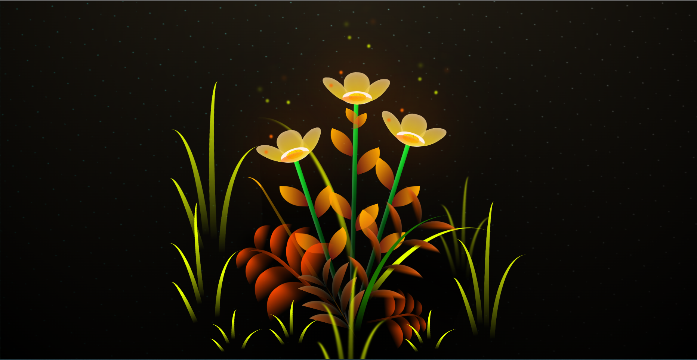
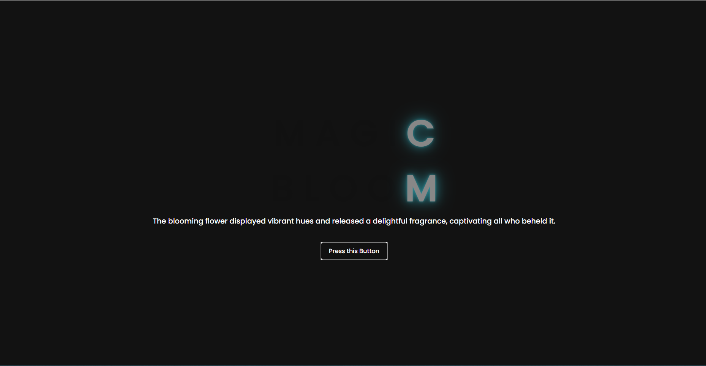

# Blooming Flower Webpage

🌸 Welcome to the Blooming Flower Webpage! 🌸

This project showcases an interactive webpage that brings the beauty of nature to your screen. Watch as a delightful flower gracefully blooms with a click, all thanks to the harmonious combination of HTML, CSS, and JavaScript.

## Preview

Take a peek at the captivating transformation:

## Features

- **Interactive Blooming:** Click on the flower to witness its mesmerizing blooming animation.
- **Elegant Design:** The project boasts a visually pleasing design that enhances the user experience.
- **Responsive:** The webpage is designed to adapt gracefully to different screen sizes, ensuring a seamless experience across devices.

## Screenshots

Witness the flower's journey from bud to bloom:

*Index Bud State*

*Full Blooming State*

## How It Works

The blooming animation is achieved by utilizing CSS animations and manipulating the DOM with JavaScript. The JavaScript function applies a CSS class that triggers the animation, creating a captivating visual effect.
